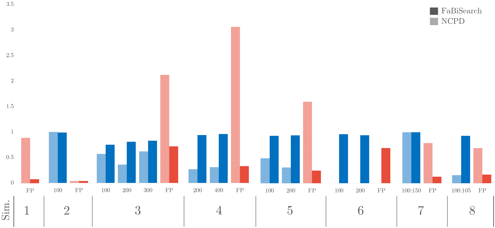

# FaBiSearch experiments

This repository contains the code and experiments for "Factorized Binary Search: change point detection in the network structure of multivariate high-dimensional time series" (Ondrus et al. 2022, 	arXiv:2103.06347 [stat.ME]). The method uses non-negative matrix factorization (NMF) to model signals, and a novel binary search based segmentation, depicted below:


## Simulations

`simulations` contains simulated data experiments and comparisons to NCPD (Network Change Point Detection). We find our method is generally superior to NCPD.



## Resting-state fMRI experiments

`rs_fMRI` contains the code for resting-state experiments, for which we investigate test-retest reliability in the [NYU CSC dataset](https://www.nitrc.org/projects/nyu_trt). An example of the estimated dynamic network structures is shown below, for subject 1 during visit 2.


## Task-based fMRI experiments

`tb_fMRI` contains the task-based experiments, where subjects are [reading Chapter 9 of *Harry Potter and the Sorcerer’s Stone*](http://www.cs.cmu.edu/~fmri/plosone/). We find change points are concentrated around key plot twists.


For more information, and to cite this work:

```bibtex
@article{ondrus2021factorized,
  title={Factorized binary search: change point detection in the network structure of multivariate high-dimensional time series},
  author={Ondrus, Martin and Olds, Emily and Cribben, Ivor},
  journal={arXiv preprint arXiv:2103.06347},
  year={2021}
}
```